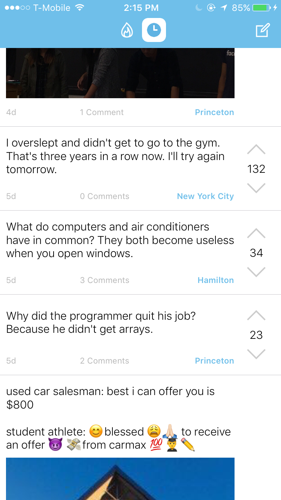
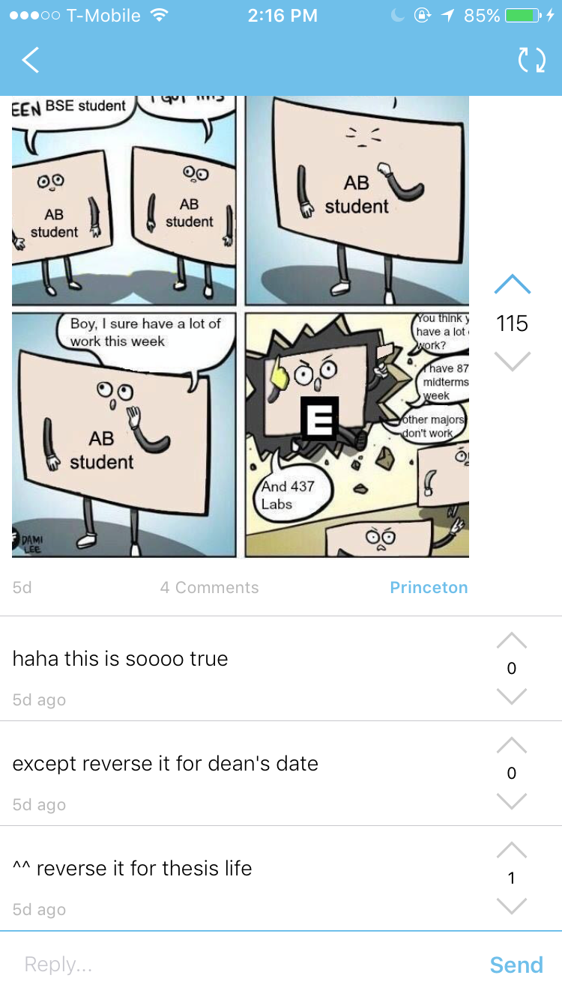
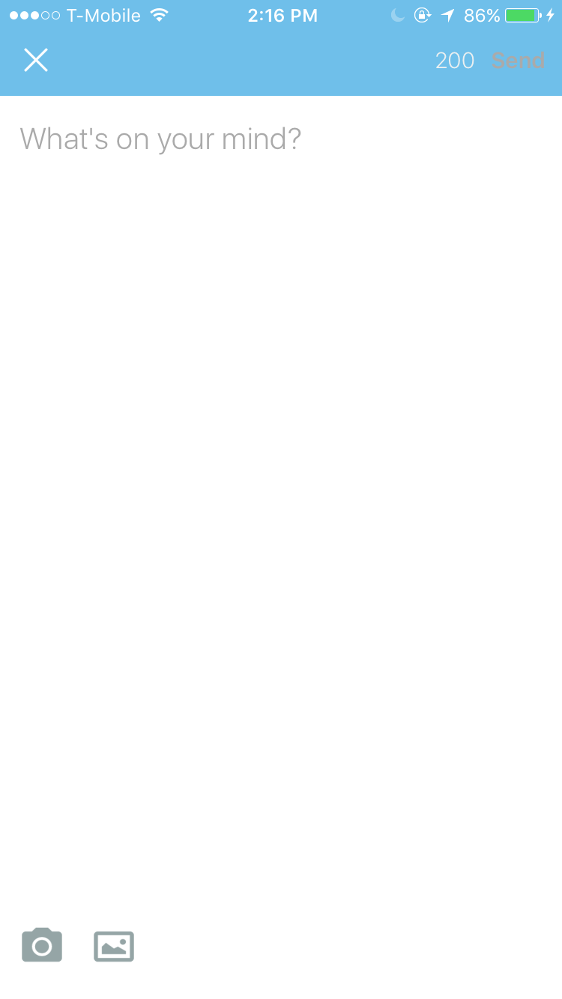
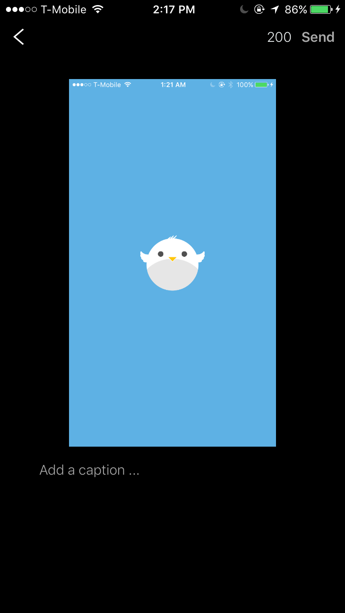
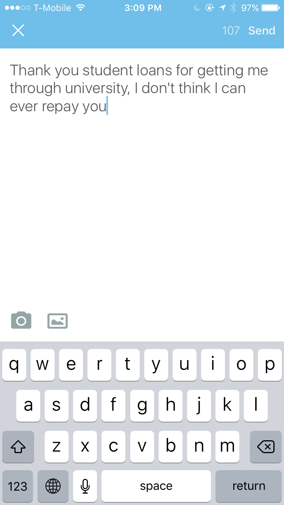

### Development
View our design doc [here](designdoc.pdf) and read more about the development of Robin [here](development.md).

### What is Robin?
Robin is an anonymous location-based social mobile application that aims to connect people via sharing. Rather than users having to check multiple social media sites like Facebook groups, Robin gives users one app where they can find funny posts, relevant questions, and a space for discussion. In addition, there is less hesitation for users to contribute, since they are doing so anonymously. Finally, Robin's radius algorithm boosts the reach of popular posts based on perceived relatability, so Robin naturally brings relevant posts to users.

### How does it work?

#### Read relatable posts

#### Comment on posts

#### Compose your own anonymous posts

#### Caption images...

#### ...or just write text

